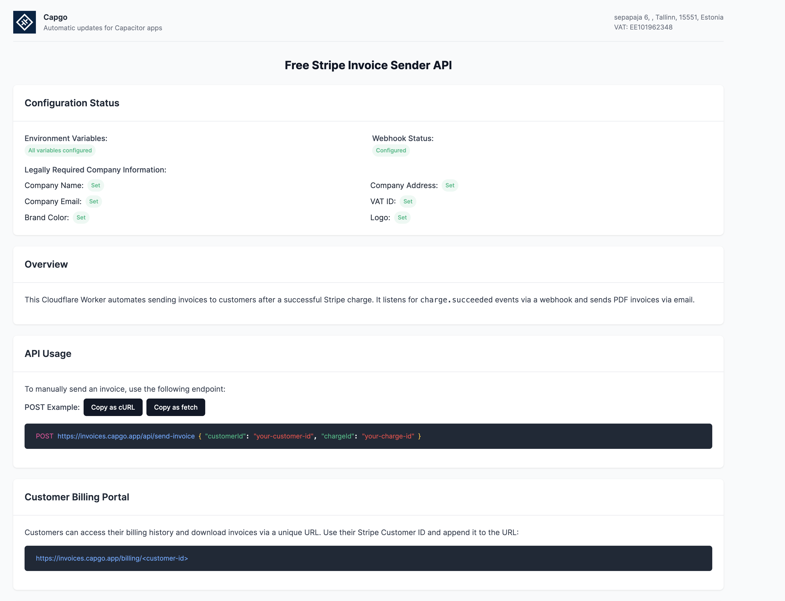
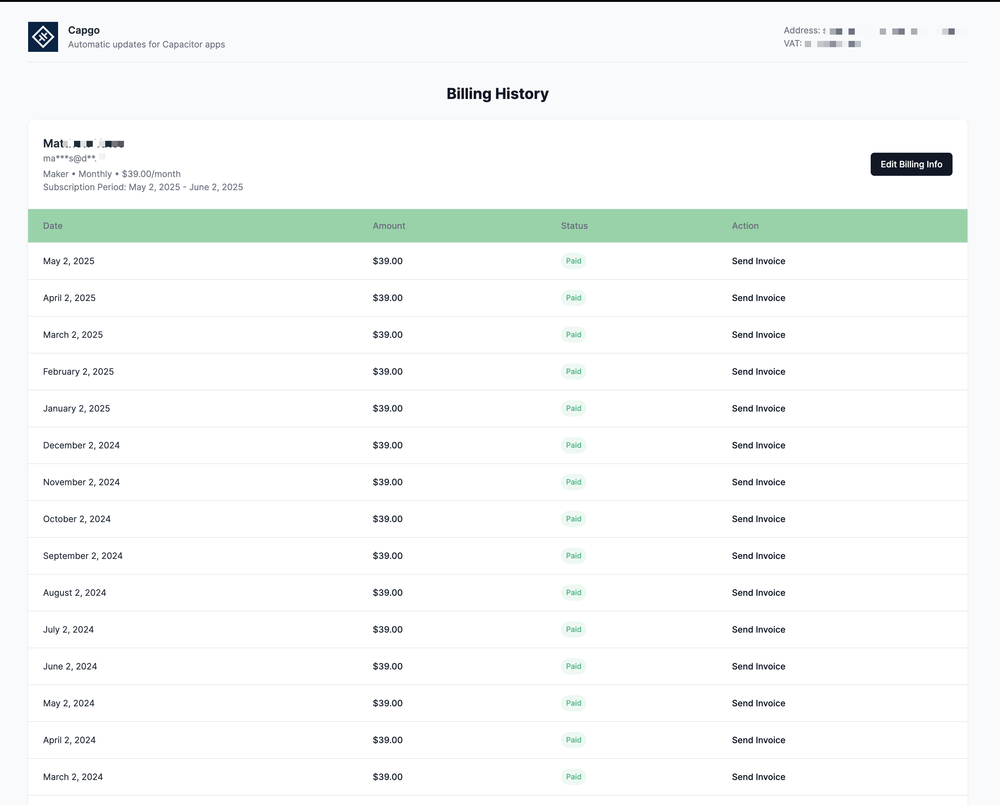
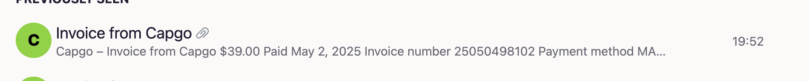
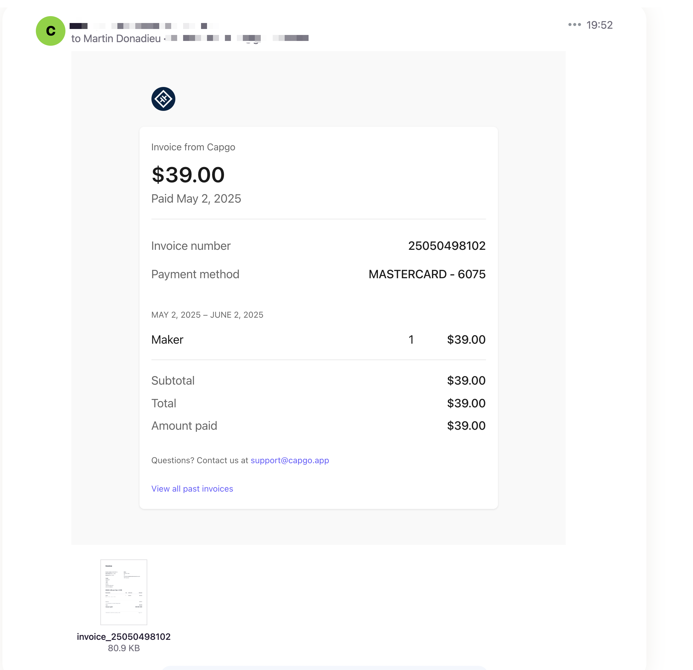
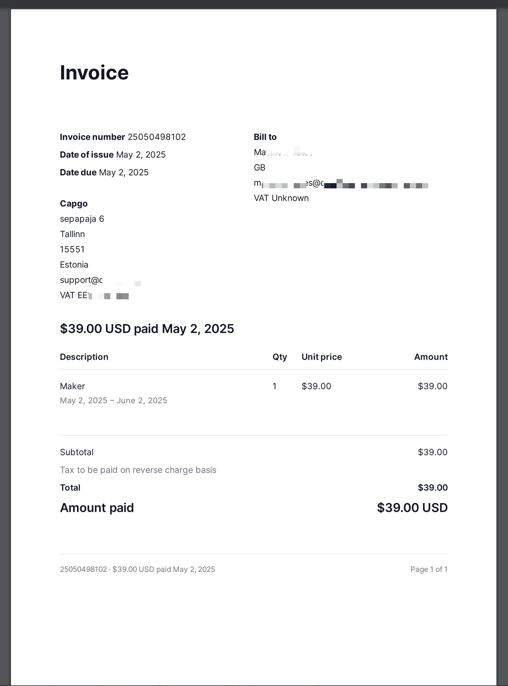

# Invoice Sender

This Cloudflare Worker automates the process of sending invoices to customers after a successful charge via Stripe.

<a href="https://deploy.workers.cloudflare.com/?url=https://github.com/Cap-go/worker-invoices" target="_blank"></a>

## Overview

This project uses Cloudflare Workers to listen for Stripe webhooks, specifically for `charge.succeeded` events, and automatically sends an invoice email to the customer with a PDF attachment. It also provides a billing history page for customers to view past charges and resend invoices.

A homepage is available at the root URL (`/`) of your deployed worker, which helps you check the configuration status, including environment variables, webhook setup, and legally required company information in stripe are properly setup.

## Purpose and Benefits

This project has been developed to help businesses avoid the additional costs associated with Stripe's invoicing feature. By using this Cloudflare Worker, you can save on Stripe invoice fees while gaining more flexibility to allow your users to update their Stripe information and receive updated invoices directly through your system.

## Features

- Automatically sends invoices via email upon successful Stripe charges.
- Generates PDF invoices using jsPDF.
- Provides a billing history page for customers.
- Allows manual invoice sending via API endpoints.
- Checks for mandatory legal information before generating invoices.

## Setup

1. **Clone the Repository**: Clone this repository to your local machine.
2. **Install Dependencies**: Run `bun install` to install the necessary dependencies.
3. **Configure Environment Variables**: Set up the required environment variables in your Cloudflare Worker dashboard or in a `.env` file for local development.
   - `STRIPE_API_KEY`: Your Stripe API key. <a href="https://dashboard.stripe.com/apikeys" target="_blank">Go to Stripe API keys dashboard (create an unrestricted key for full access)</a>
   - `RESEND_API_KEY`: Your Resend API key for sending emails. <a href="https://resend.com/api-keys" target="_blank">Go to Resend API keys dashboard</a>
   - `CF_WORKER_DOMAIN`: Your Cloudflare Worker domain.
   - `DEV_MODE`: Set to 'true' for development mode to send emails to a company email address.
4. **Deploy to Cloudflare**: Use `wrangler deploy` to deploy the worker to Cloudflare.

## Usage

- **Automatic Invoice Sending**: Once deployed, the worker will listen for Stripe `charge.succeeded` events and send invoices automatically.
- **Manual Invoice Sending**: Use the `/api/send-invoice` endpoint with a POST or GET request to manually send an invoice. Parameters required are `customerId` and `chargeId`.
- **Billing History Page**: Customers can access their billing history via a URL like `https://your-worker-domain/billing/<customer-id>`.

## Providing Customers with Invoice URL

To give customers access to their billing history and invoices, you can provide them with a direct link to their billing page. The URL format is `https://your-worker-domain/billing/<customer-id>`. Here's how you can generate and send this link:

1. **The Customer ID**: Use the Stripe customer ID as main identifier
2. **Construct the URL**: Combine your Cloudflare Worker domain with the encoded ID to form the full URL, e.g., `https://your-worker-domain/billing/${customerId}`.
3. **Send the URL**: Include this URL in your communications with the customer, such as in the invoice email (which is already implemented in this project), or through other channels like a customer portal or notification system.

This link will direct the customer to a page where they can view all past charges, download invoices, and access the Stripe billing portal to update their billing information.

## Development

- **Local Testing**: Use `wrangler dev` to run the worker locally for testing.
- **Environment Variables**: Ensure all environment variables are set correctly for local development.

## Troubleshooting

- **Check Logs**: Use Cloudflare logs to troubleshoot issues with webhook processing or email sending.
- **Email Issues**: Verify Resend API key and ensure the email service is configured correctly.
- **Stripe Webhook**: Ensure the webhook is correctly set up in Stripe to point to your Cloudflare Worker URL.

## License

This project is licensed under the MIT License - see the LICENSE file for details.

## Stripe Webhook Setup for Auto-Invoicing

The worker automatically sets up the necessary Stripe webhook to listen for `charge.succeeded` events. You don't need to manually configure this in the Stripe Dashboard. The worker runs a scheduled task every minute to ensure the webhook is set up correctly using the `CF_WORKER_DOMAIN` provided. If the webhook is not present, it will be created.

Note: Webhook signature verification is not implemented in this basic setup; for production, consider adding Stripe webhook signature verification for enhanced security.

## API Usage

Send a POST request to `/api/send-invoice` with the following JSON body for manual invoicing:

```json
{
  "customerId": "your-customer-id",
  "chargeId": "your-charge-id"
}
```

Alternatively, use a GET request to `/api/send-invoice?customerId=your-customer-id&chargeId=your-charge-id` to resend an invoice.

The API will fetch Stripe data to brand the email and PDF with the logo and brand color.

## Stripe API Key Permissions

To fetch legally required company information (such as name, address, email, VAT ID, and branding) from Stripe, an **unrestricted API key** is necessary. Restricted keys lack the permissions to access this data, which is critical for generating compliant invoices.

**Note:** While unrestricted keys have broader access, this application is secure for use with them. The code is open and readable, and as the user, you own and control the deployment of this worker. You can verify exactly what the code does with the key.

## Visual Overview

Below are some visual representations of the key features of this platform:

- **Homepage**: Check the configuration status of your Cloudflare Worker, including environment variables and webhook setup. 
  

- **Billing History Page**: Customers can view past charges and download or resend invoices from this page. 
  

- **Email Preview**: A preview of the invoice email sent to customers. 
  

- **Email**: The full invoice email with a PDF attachment sent to customers upon successful charge. 
  

- **Invoice PDF**: The generated PDF invoice attached to the email. 
  

## Stripe Configuration for Invoicing

To ensure compliance and proper invoice generation with this worker, you need to configure specific settings in your Stripe account:

- **Collect Tax ID**: In your Stripe Dashboard, go to 'Settings' > 'Tax Settings'. Enable the option to collect Tax IDs from your customers. This ensures that legally required information is captured for invoice generation.
- **Collect User Address**: In the 'Checkout Settings' or 'Payment Settings', enable the collection of billing addresses during the payment process. This information is critical for generating compliant invoices.
- **Allow User Modifications via Portal**: Enable the Stripe Billing Portal in 'Settings' > 'Billing Portal'. This allows users to update their billing information, which will be reflected in the invoices generated by this worker.
- **Fill in Company Information**: Ensure that your company details such as name, address, email, and VAT ID are updated in the 'Account Settings' under 'Business Settings'. This information will be fetched by the worker to brand invoices correctly.
- **Set Branding Details**: Update your logo, brand color, and other branding elements in Stripe under 'Settings' > 'Branding'. This worker uses a minimal setup and retrieves all company information directly from Stripe to ensure consistency in invoice branding.

## Disabling Stripe Invoicing

After setting up and testing this worker in development mode (`DEV_MODE=true`), you can disable Stripe's built-in invoicing to avoid duplicate invoices and additional costs:

1. **Test in Development Mode**: Ensure all environment variables are set, and test the worker locally or on a staging environment. Verify that invoices are being sent correctly via the worker.
2. **Disable Stripe Invoicing**: In your Stripe Dashboard, navigate to 'Settings' > 'Invoice Settings'. Turn off the option to automatically generate invoices for charges. This will prevent Stripe from sending its own invoices, allowing your Cloudflare Worker to handle all invoicing tasks.

**Note**: Only disable Stripe invoicing after thorough testing to ensure there are no disruptions in your billing process.
